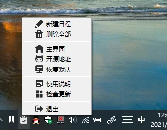

CountBoard 是一个基于Tkinter开源的桌面日程倒计时应用。 
***
**Forked By alexliu07**
***
## 基本功能 

* 磁贴主题
   * Acrylic：亚克力效果。    
   * Aero：毛玻璃效果。
* 修改功能  
    * 双击日程可修改或者删除。
    * 右键可以新建，删除，修改。
    * 支持自动删除已过期事件
    * 支持选择倒数天数类型，支持工作日或假期和节假日
* 提醒功能  
    * 定时提醒：每天固定时间进行提醒。
    * 间隔提醒：每隔多少时间进行提醒。
* 计时模式
   * 普通模式：24小时以内算做一天。    
   * 紧迫模式：24小时以内算做零天。（已过期的事件无普通、紧迫模式之分）
* 磁贴模式
   * 嵌入桌面：绑定到桌面。    
   * 独立窗体：独立的窗体，可以设置置顶等。      
   
## 预览图

  

  

 

 

## 其他说明
* 美化包: [ttkbootstrap](https://github.com/israel-dryer/ttkbootstrap)
* 托盘图标: [pywin10](https://github.com/Gaoyongxian666/pywin10)
* 数据存储: [sqlitedict](https://github.com/Gaoyongxian666/pywin10)

## 更新日志
* V1.5.2 2023-05-30 
   * 修复了在某些Windows版本上无法开机启动的问题(开机启动仅支持Windows10/11)

* V1.5.1 2023-05-09 
   * 修复了V1.5版本出现的重大bug

* ~~V1.5~~ 2023-05-03 
   **重要通知：本版本出现重大bug，请勿下载**
   * 当新版本设定加入数据库后无需重启
   * 新增了倒数日天数类型选择，可选工作日或假期和节假日
   * 重写紧迫模式算法
   * 新增了自动删除过期事件的选项
   * 自动更新程序完成了一半

* V1.4 2023-02-25
   * 新增了禁止拖动的功能
   * 删除了拖动时的灰度效果
   * 修正了“关于”界面的版本号

* V1.3.1(Fork第一版) 2023-02-18
   * 取消了设置界面的置顶
   * 移除了被注释的代码
   * 优化了文件结构
   * 移除了程序更新功能
   * 移除了应用内的使用说明
   * 移除了安装包打包功能
   * 移除了缩放功能，将控制界面的宽高最大值增高以实现缩放
   * 调整滑块右侧的数字从长小数减为整数，解决方案参考<a href="https://www.coder.work/article/3156851">这篇文章</a>
   * 将日期显示的字体更改为微软雅黑

## 如何打包
1. 安装`Python`
2. 导入/分支本仓库
3. 在Actions里面运行Package App
